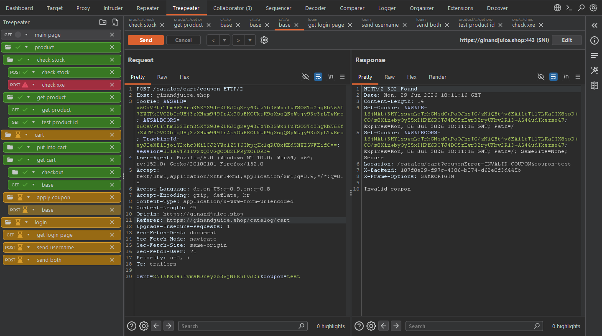
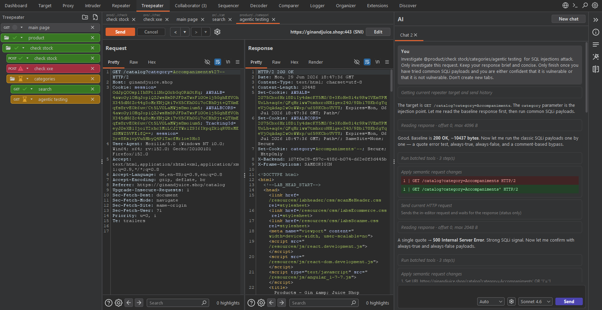
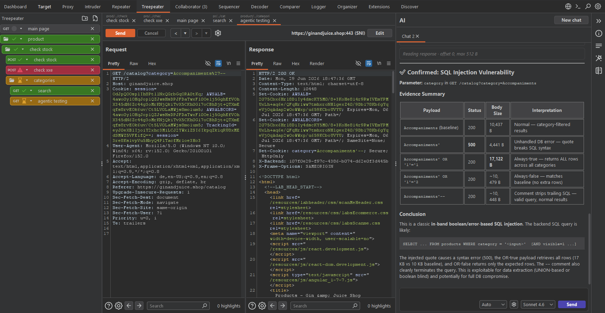
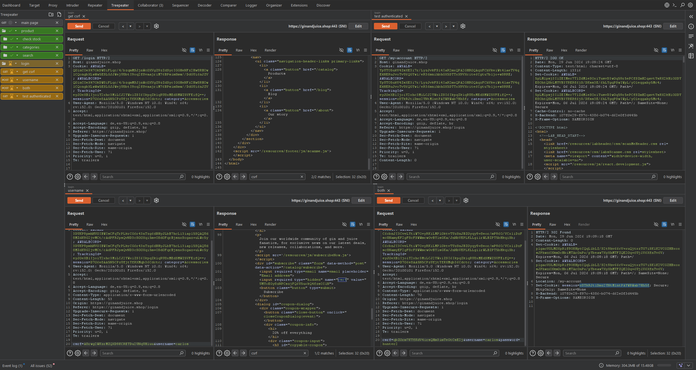
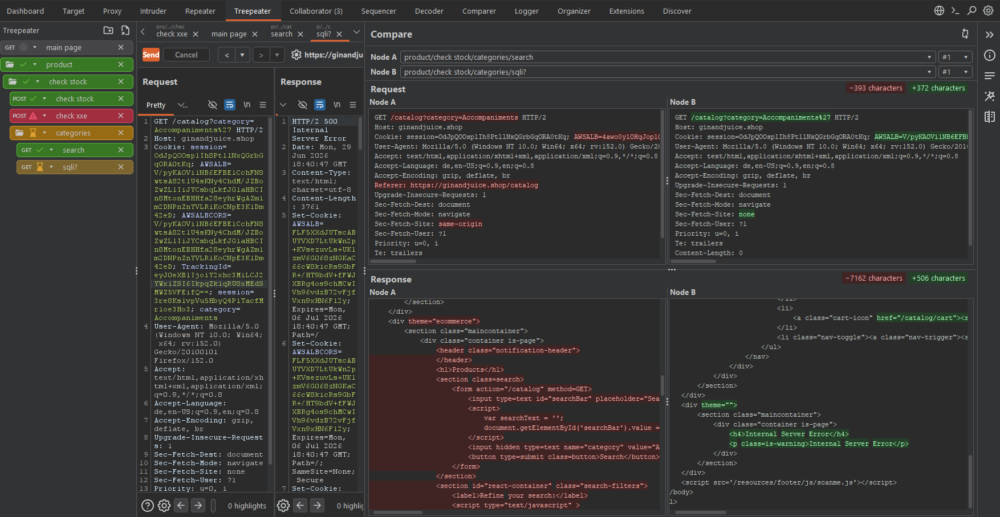

# Treepeater
Treepeater is a Burp Suite extension that lets you organize your requests in a tree structure, making it easy to mirror the layout of a real website or API.
You can group related endpoints together and nest them as deeply as needed, which is especially useful for large APIs with long, hierarchical paths.
Nodes can be freely reordered by dragging and dropping them anywhere in the tree.

Use statuses to annotate your requests and quickly identify what matters.
For example, the built-in default statuses let you flag requests that still need testing, mark them as completed, or highlight requests where you found a vulnerability.
Statuses support custom names, colors, and icons, and are color-coded in the tree so you can differentiate them at a glance.
You can also set a default status list that is applied automatically to new requests.

Each request panel keeps a full history of everything you have sent, and you can navigate back and forward through previous requests and their responses without losing any of your work.

Treepeater closely mirrors the Repeater UI to minimize the learning curve.
If you are already familiar with Repeater, you should be productive in Treepeater almost immediately.

Almost every action has a configurable keyboard shortcut — sending requests, navigating history, switching tabs, renaming nodes, changing statuses, and more.
Treepeater aims to eventually support a fully keyboard-driven workflow, though there is still work to do in that area.

## Features

Treepeater offers a vast set of features for efficient manual testing and clear organization on top of a familiar Repeater-style workflow. The primary reason I initially started developing Treepeater was the vertical, tree-based organization of requests and responses. Since then I've added further enhancements to aid in manual or automatic testing.

### Tree organization

Group requests in a nested tree that mirrors your target's structure. Drag nodes to reorder them, open several requests as tabs, and use color-coded statuses to track progress. Create your status with custom colors to adapt Treepeater to your own workflow.



### AI-assisted testing

Let agents accelerate your testing without losing control over what happened. Use the model of your choice, even via Azure, and select from different agent modes. At full throttle, agents can interpret, modify, and send requests to provide you with full support during your assessments. Everything the agent does is shown in the chat, modifications are shown in diffs, sent requests create new history entries, and with stricter agent mode it even has to ask before changing or sending anything.



When a finding is confirmed, it can summarize the result in a structured report.



### Split workspace

Split the workspace into multiple panes so you can work on several requests side by side. Split multiple times vertically or horizontally for complex requests flows, where you need to send, compare, and copy between requests without switching tabs.



### Compare

Pick any two tree nodes and diff their requests and responses side by side. Changes are highlighted with character counts, making it easy to spot subtle differences between payloads or server behavior.




## How To Install

Install Treepeater either using the already built JAR from the releases or build the JAR yourself following chapter [How To Build](#how-to-build).
Either way, you'll have a JAR file that you want to load into Burp.

### Loading the JAR file into Burp

To load the JAR file into Burp:

1. In Burp, go to **Extensions > Installed**.
2. Click **Add**.
3. Under **Extension details**, click **Select file**.
4. Select the JAR file you just built, then click **Open**.
5. Click **Next**. The extension is loaded into Burp.
6. Click **Close**.

Your extension is loaded and listed in the **Burp extensions** table. You can test its behavior and make changes to the code as necessary.


## How To Build
* [Before you start](#before-you-start)
* [Writing your extension](#writing-your-extension)
* [Building your extension](#building-your-extension)
* [Loading the JAR file into Burp](#loading-the-jar-file-into-burp)
* [Sharing your extension](#sharing-your-extension)

### Requirements

To build the JAR yourself, you need to have Java JDK 21 installed and it must be available on the path.

### Building the Extension

Build the extension by executing the following command
```
./gradlew jar
```

This command will install all the necessary libraries and build one JAR that can then simply be installed to Burp.
If successful, the JAR file is saved to `./build/libs/Treepeater.jar`.

