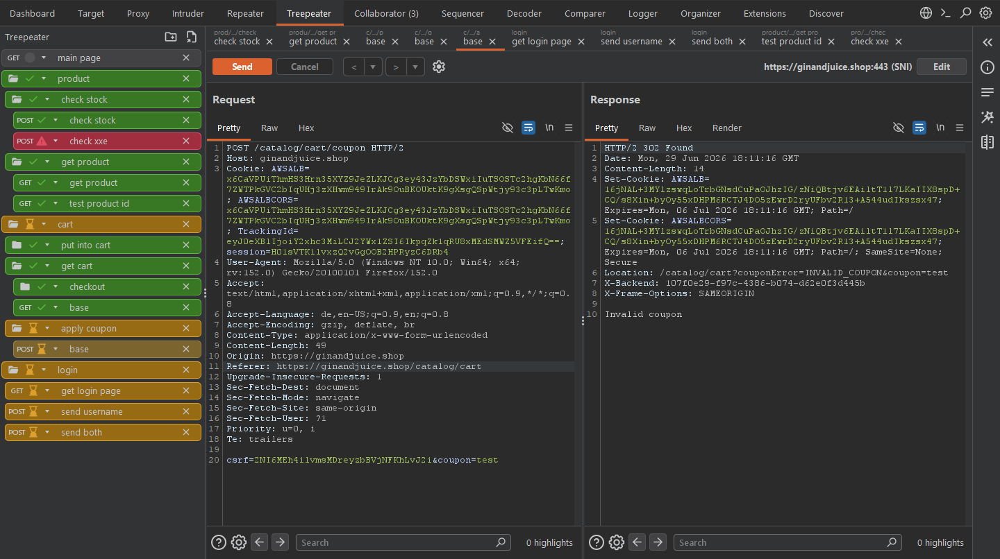
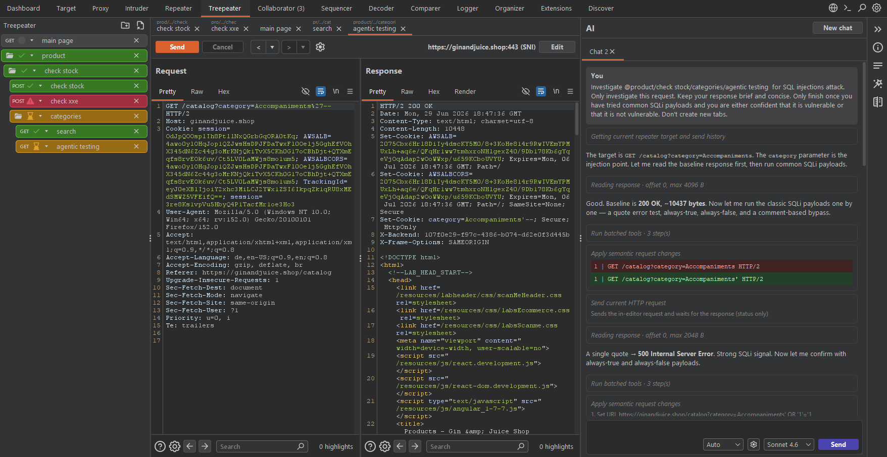
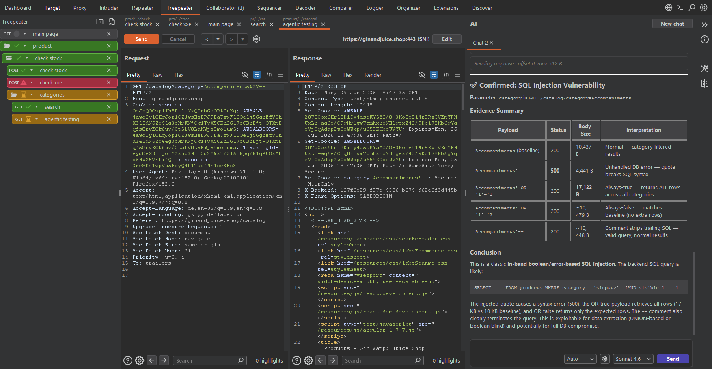
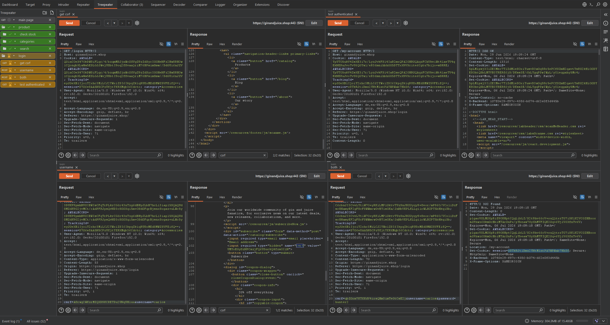
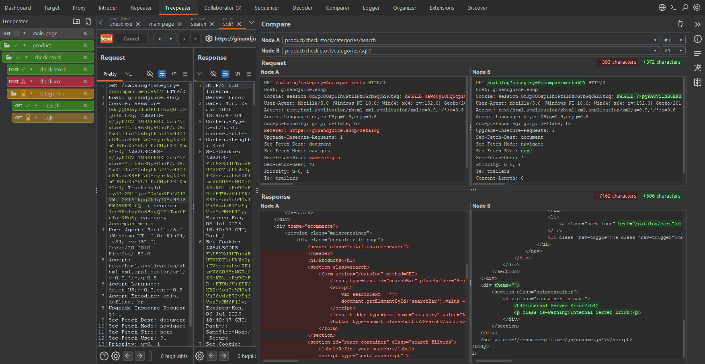
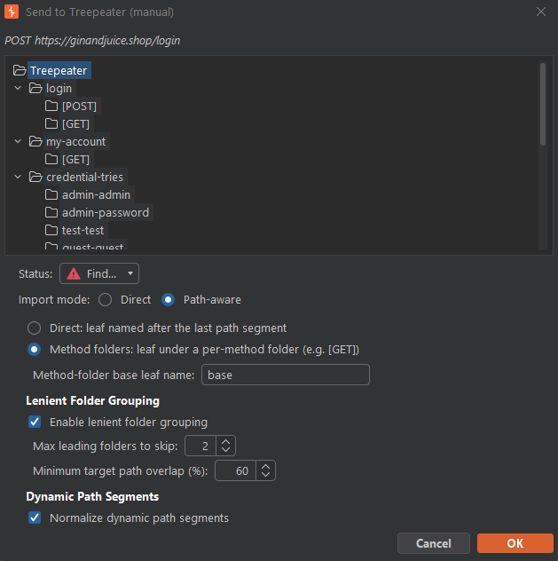

# Treepeater
Treepeater is a Burp Suite extension that lets you organize your requests in a tree structure, making it easy to mirror the layout of a real website or API.
You can group related endpoints together and nest them as deeply as needed, which is especially useful for large APIs with long, hierarchical paths.
Nodes can be freely reordered by dragging and dropping them anywhere in the tree.

Use statuses to annotate your requests and quickly identify what matters.
For example, the built-in default statuses let you flag requests that still need testing, mark them as completed, or highlight requests where you found a vulnerability.
Statuses support custom names, colors, and icons, and are color-coded in the tree so you can differentiate them at a glance.
You can also set a default status list that is applied automatically to new requests.

Each request panel keeps a full history of everything you have sent, and you can navigate back and forward through previous requests and their responses without losing any of your work.

Treepeater closely mirrors the Repeater UI to minimize the learning curve.
If you are already familiar with Repeater, you should be productive in Treepeater almost immediately.

Almost every action has a configurable keyboard shortcut, like sending requests, navigating history, switching tabs, renaming nodes, changing statuses, and more.
Treepeater aims to eventually support a fully keyboard-driven workflow, though there is still work to do in that area.

## Features

Treepeater offers a vast set of features for efficient manual testing and clear organization on top of a familiar Repeater-style workflow. The primary reason I initially started developing Treepeater was the vertical, tree-based organization of requests and responses. Since then I've added further enhancements to aid in manual or automatic testing.

### Tree organization

Group requests in a nested tree that mirrors your target's structure. Drag nodes to reorder them, open several requests as tabs, and use color-coded statuses to track progress. Create your status with custom colors to adapt Treepeater to your own workflow.



### AI-assisted testing

Let agents accelerate your testing without losing control over what happened. Use the model of your choice, even via Azure, and select from different agent modes. At full throttle, agents can interpret, modify, and send requests to provide you with full support during your assessments. Everything the agent does is shown in the chat, modifications are shown in diffs, sent requests create new history entries, and with stricter agent mode it even has to ask before changing or sending anything.



When a finding is confirmed, it can summarize the result in a structured report.



### Split workspace

Split the workspace into multiple panes so you can work on several requests side by side. Split multiple times vertically or horizontally for complex requests flows, where you need to send, compare, and copy between requests without switching tabs.



### Compare

Pick any two tree nodes and diff their requests and responses side by side. Changes are highlighted with character counts, making it easy to spot subtle differences between payloads or server behavior.



### Importing requests

To import requests into Treepeater, use keyboard shortcuts or the context menu. There are three imports modes: ***direct**, **path-aware**, and **manual**.

#### Path-aware import

**Send to Treepeater (path-aware)** builds a folder hierarchy from the request URL path and places the request as a leaf node. Existing folders are reused, so importing many requests from the same API gradually fills in the tree without duplicate folders.

For a request to `GET /api/users/42`, path-aware import creates (or reuses) an `api` folder, then a `users` folder underneath, and adds a leaf named `42`. Importing `GET /api/users/99` lands in the same folder chain.

Two leaf modes are available in **Settings > Import**:

- **Direct**: the leaf is named after the last path segment and sits next to any deeper nesting folder for the same segment. For example, `GET /first/third` creates a leaf `third` under `first`, while `GET /first/third/test` adds a `third` folder (for deeper paths) with a `test` leaf inside it.
- **Method folders**: the leaf is placed under a per-method folder such as `[GET]` or `[POST]`, using a configurable base leaf name (default `base`).

Optional refinements, also configured under **Settings > Import**:

- **Lenient folder grouping**: when strict path matching finds no existing folder chain, Treepeater can attach requests under folders that include extra leading grouping segments. If you already have `ServiceA/users` and import `/users/1`, the request goes under `ServiceA/users` instead of creating a new top-level `users` folder. The algorithm enforces some constraints on this to avoid mismatching. For example, only a certain number of leading folders are allowed (default: 2) and the existing path must match a specific percentage of the importing path (default: 60%). These values can be configured in the settings.
- **Dynamic path segment normalization**: recognizable dynamic segments (numeric IDs, UUIDs, OData keys) are rewritten into placeholders such as `:id` or `:uuid` before building folders, so `/users/2/status` and `/users/7/status` share a `users/:id/status` structure. The original URL on the leaf is always preserved.

Given these settings, path-aware import maps URL paths to a tree like this:

**Direct leaf mode**: leaf named after the last path segment:

```
GET /api/users/42
GET /api/users/99
GET /api/users/third/info

api/
└── users/
    ├── 42
    ├── 99
    └── third/
        └── info       
```

**Method folders**: leaf under `[METHOD]` with base name `base`:

```
GET /first
POST /first/test

first/
├── [GET]/
│   └── base      <- GET /first
└── test/
    └── [POST]/
        └── base   <- POST /first/test
```

**Dynamic path segment normalization**: enabled, numeric IDs collapse to `:id`:

```
GET /users/2/status
GET /users/7/status

users/
└── :id/
    └── status     <- both requests share this folder chain
```

Path-aware import uses your global import settings and can be triggered via a configurable hotkey.

#### Manual import

**Send to Treepeater (manual)** opens a dialog where you choose exactly where and how each request is placed. Use it when you want control over the destination folder, need a one-off naming override, or are importing a batch of requests into the same place.

The dialog shows:

- A **folder tree** to pick the destination folder (required).
- The **request** being imported (method and URL), with batch progress when multiple requests are selected.
- A **status** to apply to the imported request.
- An **import mode** toggle between **Direct** and **Path-aware**:
  - **Direct**: adds a single leaf under the chosen folder. Name it by URL, path, sequential ID, or a manual name you type.
  - **Path-aware**: builds folders from the URL path under the chosen folder, with the same leaf-mode, lenient-grouping, and dynamic-segment options as global path-aware import, but scoped to your selected anchor folder.
- **Apply to all**: when importing multiple requests, reuse the current folder and options for the rest of the batch without showing the dialog again.

Manual import is also available via a configurable hotkey.




## How To Install

Install Treepeater either using the already built JAR from the releases or build the JAR yourself following chapter [How To Build](#how-to-build).
Either way, you'll have a JAR file that you want to load into Burp.

### Loading the JAR file into Burp

To load the JAR file into Burp:

1. In Burp, go to **Extensions > Installed**.
2. Click **Add**.
3. Under **Extension details**, click **Select file**.
4. Select the JAR file you just built, then click **Open**.
5. Click **Next**. The extension is loaded into Burp.
6. Click **Close**.

Your extension is loaded and listed in the **Burp extensions** table. You can test its behavior and make changes to the code as necessary.


## How To Build
* [Before you start](#before-you-start)
* [Writing your extension](#writing-your-extension)
* [Building your extension](#building-your-extension)
* [Loading the JAR file into Burp](#loading-the-jar-file-into-burp)
* [Sharing your extension](#sharing-your-extension)

### Requirements

To build the JAR yourself, you need to have Java JDK 21 installed and it must be available on the path.

### Building the Extension

Build the extension by executing the following command
```
./gradlew jar
```

This command will install all the necessary libraries and build one JAR that can then simply be installed to Burp.
If successful, the JAR file is saved to `./build/libs/Treepeater.jar`.

